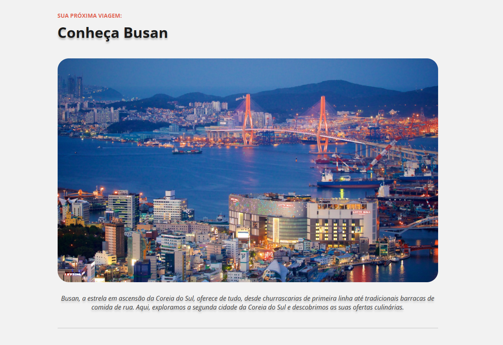

# Project Tourist Place

Um projeto de estudo desenvolvido durante meus aprendizados na Rocketseat, onde construí uma página web para apresentar lugares turísticos com um design moderno e responsivo.

## 🛠 Tecnologias

- HTML5
- CSS3
- Git

## 📚 O que eu pratiquei

- Estruturação semântica com HTML5
- Estilização com CSS3 e layouts responsivos
- Manipulação do DOM com JavaScript
- Controle de versão com Git

## 🚀 Como visualizar

1. Clone este repositório:

   ```bash
   git clone https://github.com/pNetwo/Project-Tourist-Place.git
   ```

2. Navegue até a pasta do projeto:

   ```bash
   cd Project-Tourist-Place
   ```

3. Abra o arquivo `index.html` no seu navegador preferido

## 📸 Preview



## 👨‍💻 Contato

**Paulo Neto**  
[GitHub](https://github.com/pNetwo)
